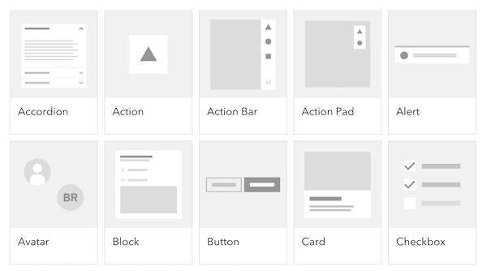
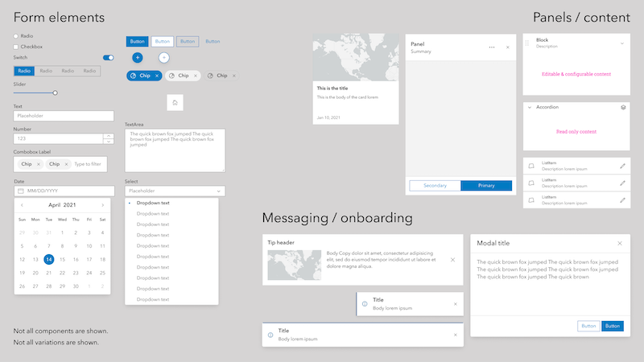
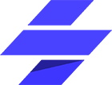
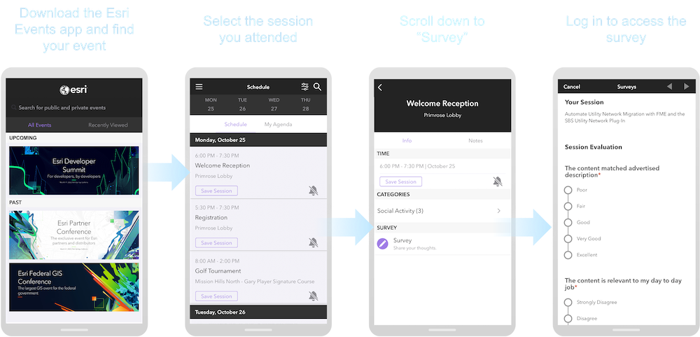

<!-- .slide: data-background="img/2022/dev-summit/bg-1.png" data-background-size="cover" -->

<h1 style="text-align: left; font-size: 80px;">Building Geospatial Web Components</h1>

<p style="display: flex; line-height: normal; gap: 14px; color: var(--r-section-subhead-color);"><calcite-avatar scale="l" full-name="Dhrumil Shah" thumbnail="./img/dhrumil.jpeg"></calcite-avatar>Dhrumil Shah<calcite-avatar style="margin-left: 14px" scale="l" full-name="Matt Driscoll" thumbnail="./img/matt.jpeg"></calcite-avatar>Matt Driscoll </p>

<p style="text-align: left; font-size: 30px;">Slides: <a href="https://esriurl.com/ds2022-geo-web-components"><code>esriurl.com/ds2022-geo-web-components</code></a></p>

---

# Agenda

- Geospatial Components <!-- Matt -->
  - Background (How/Why)<!-- Matt -->
  - Composition (JSAPI/Calcite Design System)<!-- Matt -->
  - Component Architecture (Web Components/Stencil.js)<!-- Matt -->
- Patterns & Practices <!-- Dhrumil -->
  - JSAPI Integration <!-- Dhrumil -->
- Application Architecture <!-- Dhrumil -->
  - Benefits <!-- Dhrumil -->
- Demo: Esri web apps using geospatial components <!-- Dhrumil -->
- Demo: Sample app using geospatial components  <!-- Dhrumil & Matt -->

---

<!-- .slide: data-background="img/2022/dev-summit/bg-7.png" data-background-size="cover" -->

# Geospatial Components

[]

---

# Background

- Map Viewer (2019)
  - Major browsers started supporting web components
  - Calcite design system
- Components
  - Re-use entire workflows in the new map viewer and other applications
  - Framework agnostic

---

# What are they?

- Higher level componnets
- GIS functionality (JSAPI)

[]

---

# Composition

- Composed of
  - ArcGIS JS API
  - Calcite Design System
    - Components
- Built as a web component

---

<!-- .slide: data-background="img/2022/dev-summit/bg-7.png" data-background-size="cover" -->

# ArcGIS API for JavaScript

[](https://developers.arcgis.com/javascript/latest/)

---

<!-- .slide: data-background="img/2022/dev-summit/bg-7.png" data-background-size="cover" -->

# Calcite

[](https://developers.arcgis.com/calcite-design-system/)

---

# Calcite: Esri's design system

- Visual language for products
  - [Design guidelines](https://developers.arcgis.com/calcite-design-system/foundations/colors/)
    - Color, Spacing, Typography...
  - Graphic resources (Icons, symbols, Figma UI Kit)
  - Interactive documentation
    - Patterns & best practices
  - Reusable components
- Closes the gap between designers and UI engineers

---

# Calcite Components

- Web Components for Calcite Design System
  - 50+ web components
    - Ready to use
    - Reusable
    - Provides a library of patterns
  - Internal & external use
    - [Developer subscription](https://developers.arcgis.com/pricing/build-arcgis-solutions/)
  - Easily build beautiful consistent apps

---

# Componenent Documentation

[](https://developers.arcgis.com/calcite-design-system/components/)

---

# Types



---

<!-- .slide: data-background="img/2022/dev-summit/bg-7.png" data-background-size="cover" -->

# Calcite Benefits

---

# Consistency <calcite-icon scale="l" icon="thumbs-up"></calcite-icon>

- Consistent UX
  - Esri identity (look & feel)
  - Best practices
  - Conventions
- Clear direction for designers & developers

---

# Efficiency <calcite-icon scale="l" icon="thumbs-up"></calcite-icon>

- Reduced effort & cost
  - Apps follow agreed upon designs workflows
  - Reduce cost of design updates
  - Reusable (Stop reinventing the wheel)
- Speed up development timelines
  - Build Compelling Web Apps Faster

---

# Accessibility <calcite-icon scale="l" icon="thumbs-up"></calcite-icon>

- Follows [WCAG](https://www.w3.org/WAI/standards-guidelines/wcag/) (W3 a11y guidelines)
  - Semantics
  - Keyboard access
  - Color contrast
  - Text alternatives
- Continuous Integration testing using [deque axe API](https://www.deque.com/)

---

# Standards-based <calcite-icon scale="l" icon="thumbs-up"></calcite-icon>

- Web components
  - W3C specification (future-proof)
  - Encapsulation (Shadow DOM)
  - Familiarity (HTML)
  - Framework agnostic (Can be used in any framework)

---

<!-- .slide: data-background="img/2022/dev-summit/bg-7.png" data-background-size="cover" -->

# Web Components


---

# About Web Components

- Suite of different technologies (web standards)
- Allows you to create reusable custom elements
  - `<my-custom-element>`
  - Functionality encapsulated
  - Utilize them in your web apps
- Supported by modern browsers

---

# Technology

- Custom elements
  - Browser-compatible elements
  - Use native APIs
  - DOM element lifecycle
- HTML slotting
- `<slot>` elements
- Shadow DOM
  - Encapsulates component HTML & CSS
  - `<slot>` tag for distributing content

---

# Configuring Web Components

## Properties & Attributes

```html
<my-component prop="myValue"></my-component>
```

## Slots

```html
<my-component><button slot="footer" /></my-component>
```

---

# Named Slots

To customize certain regions

```html
<calcite-card>
  <h3 slot="title">Esri</h3>
  
  <span slot="subtitle">Esri is an international supplier
     of geographic information system software, web GIS
     and geodatabase management applications.</span>
</calcite-card>
```

<iframe width="310" height="310" data-src="snippets/card.html" data-preload scrolling="no"></iframe>

---

# Default Slots

For default content placement

```html
<calcite-split-button scale="l" primary-text="My Button!">
  <calcite-dropdown-group>
    <calcite-dropdown-item>Option 1</calcite-dropdown-item>
    <calcite-dropdown-item>Option 2</calcite-dropdown-item>
    <calcite-dropdown-item>Option 3</calcite-dropdown-item>
  </calcite-dropdown-group>
</calcite-split-button>
```

<calcite-split-button style="text-align: left" scale="l" primary-text="My Button!">
  <calcite-dropdown-group>
    <calcite-dropdown-item>Option 1</calcite-dropdown-item>
    <calcite-dropdown-item>Option 2</calcite-dropdown-item>
    <calcite-dropdown-item>Option 3</calcite-dropdown-item>
  </calcite-dropdown-group>
</calcite-split-button>

---

# Basic Web Component

```js
class MyComponent extends HTMLElement {
  connectedCallback() {
    let shadow = this.attachShadow({ mode: 'open' });
    shadow.innerHTML = `<h2>Hello DevSummit!</h2>`;
  }
}

customElements.define("my-component", MyComponent);
```

```html
<my-component></my-component>
```

<my-component></my-component>

---

<!-- .slide: data-background="img/2022/dev-summit/bg-7.png" data-background-size="cover" -->

# Component Architecture

---

# Stencil.js

[](https://stenciljs.com/)

- Toolchain for building Design Systems
- Built by [Ionic framework](https://ionicframework.com/) team
- Compiles Web Components
- Virtual DOM, Typescript, and JSX
- [Getting Started](https://stenciljs.com/docs/getting-started)

---

# Basic Component Class

```jsx
import { Component, Prop, h } from "@stencil/core";

@Component({
  tag: "my-first-component",
})
export class MyComponent {
  // Name should be a public property on component
  @Prop() name: string;

  render() {
    return <p>My name is {this.name}</p>;
  }
}
```

---

# Basic Component HTML Markup

```html
<my-first-component name="Matt"></my-first-component>
```

When rendered, the browser will display `My name is Matt`

---

<!-- .slide: data-background="img/2022/dev-summit/bg-7.png" data-background-size="cover" -->

# Patterns & Practices

---

<!-- .slide: data-background="img/2022/dev-summit/bg-7.png" data-background-size="cover" -->

# Application Architecture

---

# Map viewer Architecture

---

# Host application

It provides the application shell which is built using the calcite components based on the ArcGIS for JavaScript Widget framework

---

# Micro frontend

Map Viewer is built as a micro frontend based application as a composition of features developed as web components by different teams.

---

# Example Geospatial Components

Some of the Geospatial web components/Micro-Frontends used in Map Viewer

  - Popup configurator
  - Effects
  - Sketch
  - Charts
  - Symbology

---

# Micro frontend Benefits

- Independence
  - Self-contained and independently upgradable
- Easier change management
  - Smaller component based micro apps
  - Independent from the application
  - Simplifies change management
- Speed of Development
  - Deliver the features faster
- Mission Focussed
  - Focussed in its mission to develop, test and refactor

---

# Geospatial components patterns & practices

- Micro frontend composition in the browser
  - Using Web Components provides us a client-side composition approach
- Shared Design System
  - To provide consistent look and feel across all frontend components
- "Props Down, Events Up" communication pattern
  - Pass different required properties
- Components get the application state via Props

---

# Demo: Sample app using geospatial components

- [Charts Components in Map Viewer](https://analysis-0.maps.arcgis.com/apps/mapviewer/index.html?webmap=cdd0cc7b23e04873b74f0f160dd2e7c9)
- [Charts Components in Charts Viewer Instant App](https://analysis-0.maps.arcgis.com/apps/instant/charts/index.html?appid=076e071d336d4f0eb90fdf1c535ae379)

---

<!-- .slide: data-background="img/2022/dev-summit/bg-7.png" data-background-size="cover" -->

# Questions? 🤔

---

# Please Share Your Feedback in the App​



---

<!-- .slide: data-background="img/2022/dev-summit/bg-8.png" data-background-size="cover" -->
